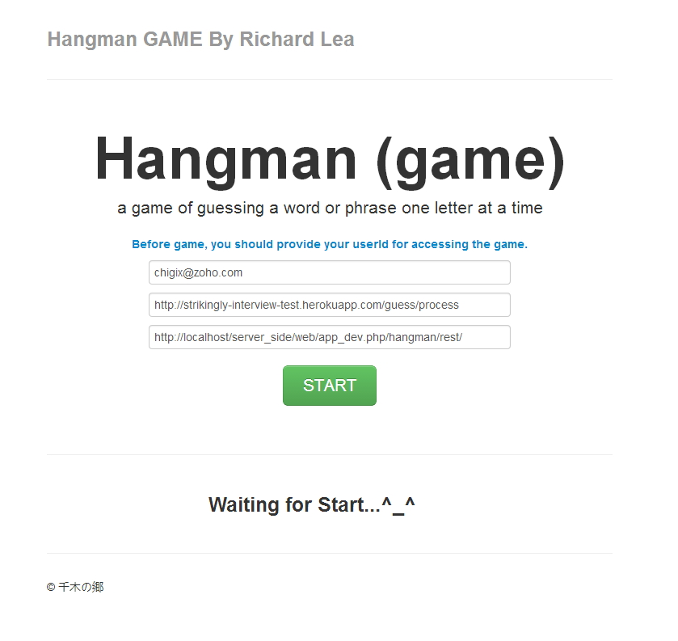
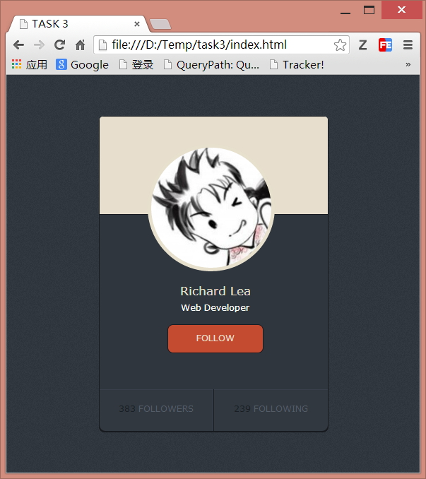

ABOUT TASK 2 & 3
=========================

Richard Lea

2014

chigix[AT]zoho.com

## Task 2

There is two part consisted in the game design , perspectivly contributing the both side working.

The main entry point is the file, `index.html`, in the folder `main_frontend`.

In the entry glance, there is three input field for customer: userId, Strikingly REST, Support Rest.

The first and second was provided by Strikingly, and the last one was powered by a PHP program, developed by me, to offer Word Suggestion Support.

Of course, the last one is optional. If given, then the keyboard in the game would always refresh orders to pop up the high frequecy char key.

## Task 3

That's it.↓

Only with an avatar picture and a background texture, which could be controlled via pageFrame and elements;

Besides, I provide a style component in the ui layer, which could be highly reused with only a height and width given via pageFrame. 

